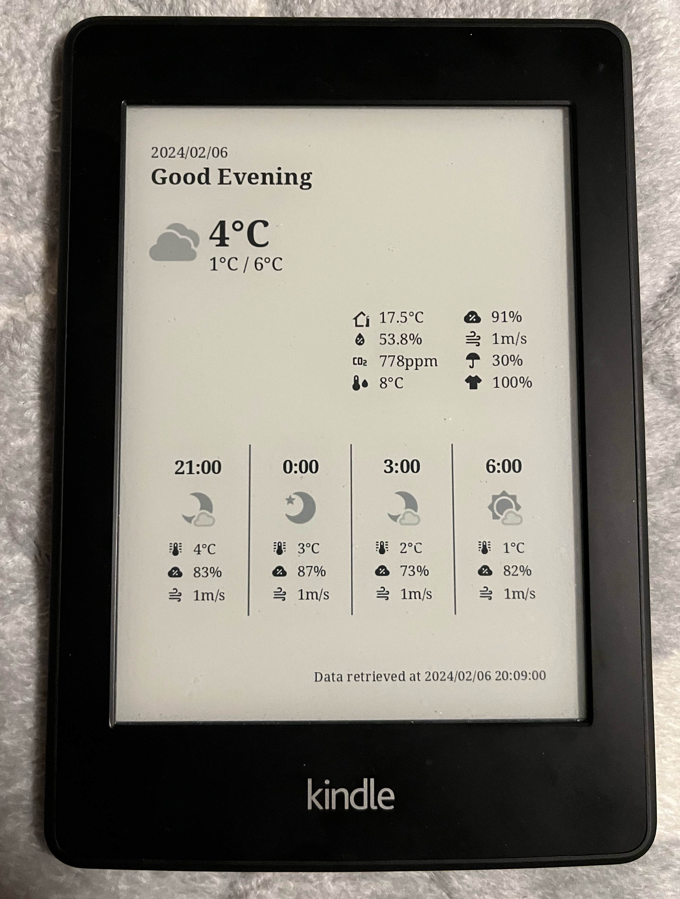

# kindash

Generates a dashboard page optimized for Kindle to be displayed as a [custom screensaver](https://www.mobileread.com/forums/showthread.php?t=236104)

Consists of 3 parts:

- `dashboard.tsx` - Dashboard generation (HTML markup)
- `data.tsx` - Data fetching for dashboard via APIs/Web Scraping
- `image.tsx` - Image generation by taking a snapshot of the dashboard page

All of the above parts are tied together via Elysia, which runs the web server/cronjob.

## Screenshots

### Dashboard on Kindle



### Dashboard on Web Browser


## Tech Stack

### Infrastructure

- [Nix](https://nixos.org/)
- [Docker](https://www.docker.com/)

### Application

- [Bun](https://bun.sh/)
- [Elysia](https://elysiajs.com/)
- [UnoCSS](https://unocss.dev/)
- [Puppeteer](https://pptr.dev/)
- [Biome](https://biomejs.dev/)

## Usage

### Server

The easiest way would be to spin up a docker container instance:

```bash
$ docker run -it --rm -e PORT=6969 -p 6969:6969 adwinying/kindash
```

- HTML preview: `http://[hostname]:6969`
- PNG URL: `http://[hostname]:6969/dash.png`

**Note:** Data/image is updated every 9th minute of every hour.

### Client (ie. Kindle)

1. Jailbreak your kindle and install the [online screensaver extension](https://www.mobileread.com/forums/showthread.php?t=236104)

2. Patch the extension as shown in [this thread](https://www.mobileread.com/forums/showpost.php?p=4252292&postcount=78)

3. Configure the extension schedule and set the image URL to `http://[hostname]:6969`

4. Test the extension by running `/mnt/us/extension/onlinescreensaver/bin/schedule.sh`

5. If no errors occured then enable the extension in KUAL menu

## Development

```bash
bun run dev
```

Open http://localhost:3000/ with your browser to see the result.
