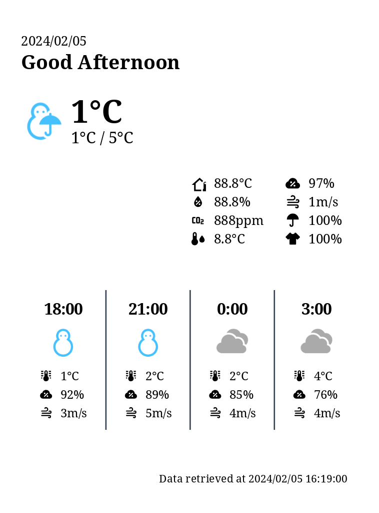

# kindash



Generates a dashboard page optimized for Kindle to be displayed as a [custom screensaver](https://www.mobileread.com/forums/showthread.php?t=236104)

Consists of 3 parts:

- `dashboard.tsx` - Dashboard generation (HTML markup)
- `data.tsx` - Data fetching for dashboard via APIs/Web Scraping
- `image.tsx` - Image generation by taking a snapshot of the dashboard page

All of the above parts are tied together via Elysia, which runs the web server/cronjob.

## Tech Stack

- [Bun](https://bun.sh/)
- [Elysia](https://elysiajs.com/)
- [UnoCSS](https://unocss.dev/)
- [Puppeteer](https://pptr.dev/)
- [Biome](https://biomejs.dev/)

## Development

```bash
bun run dev
```

Open http://localhost:3000/ with your browser to see the result.
